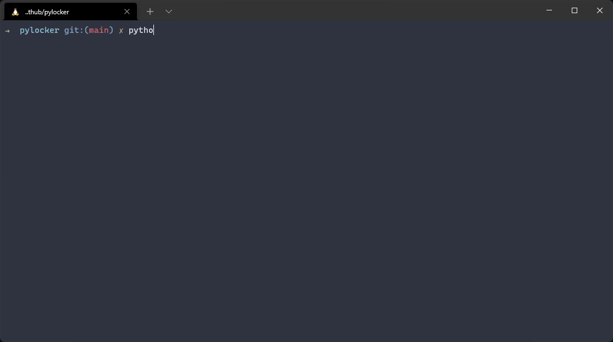

# pylocker
An easy-to-use python application to encrypt/decrypt files.

# Project Update

This repo is being replaced by [`sdcrypt`](https://www.github.com/tilas01/sdcrypt) I will keep this repo up but it will no longer be updated. If you wish to continue using this tool I recommend you switch to [`sdcrypt`](https://www.github.com/tilas01/sdcrypt).

[`sdcrypt`](https://www.github.com/tilas01/sdcrypt) Improvements:

* Recursive Encryption/Decryption
* Better code
* More reliable
* Clearer errors
* Minor modifications to UI
* Will receive any changes I make



Contents
========

 * [Disclaimer](#Disclaimer)
 * [Why?](#why)
 * [Requirements](#requirements)
 * [Installation](#installation)
 * [Use](#use)
 * [Features](#features)
 * [Note](#note)
 * [To-Do](#to-do)
 * [License](#license)

### Disclaimer
---
Use this program at your own risk. I am not responsible your data. Always keep a backup

### Why?
---
Mostly for fun/learning but also to provide a simple tool for cryptographically secure encryption/decryption in python.

### Requirements
---
To use this program you will require [`python`](https://www.python.org/) 3.9 or higher

### Installation
---
Install with [`git`](https://git-scm.com/)
```
$ git clone https://github.com/tilas0/pylocker.git
$ cd pylocker
$ pip3 install -r requirements.txt
$ python3 main.py
```

### Use
---
To reset your password:

``
Ensure all files are in a decrypted state. Then delete the "hash" file located in the config directory.
``

To reset your salt:

``
Ensure all files are in a decrypted state. Then delete the "hash" and "salt" files located in the config directory. This will also reset your password.
``

To use a backed up salt:

``
Create a "config" directory in the same location as pylocker. Then in that config directory create an extensionless file named "salt" and put the salt into that file.
``


### Features
---
- Cryptographically secure encryption/decryption, password hashing and salt generation
- Any file or folder can be encrypted
- Filename encryption/decryption
- Password input is not displayed
- Cross-platform support

### Note
---
Recursive encryption/decryption is not supported.

### To-Do
---
- Command-line arguments
- ASCII Art
- Graphical UI

### License
---
Licensed under the [MIT License](LICENSE)